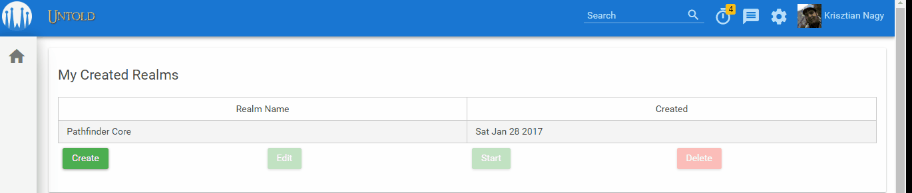
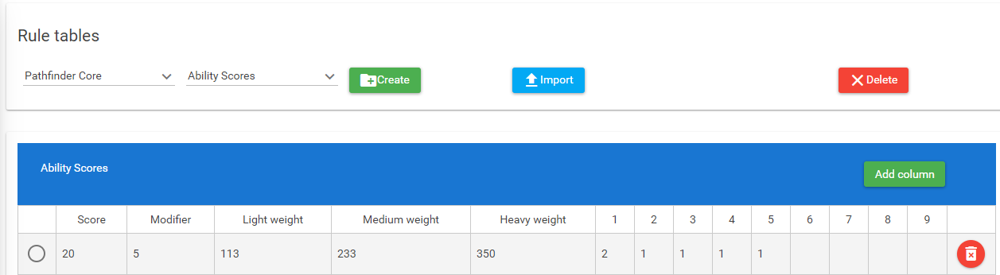
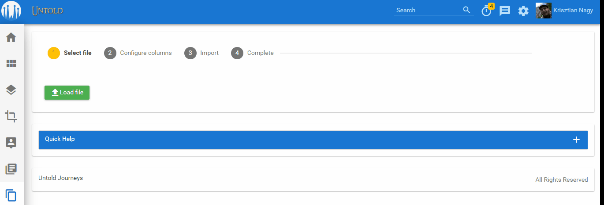
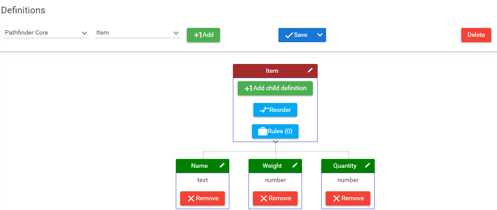
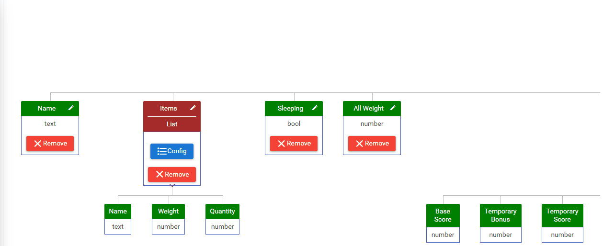
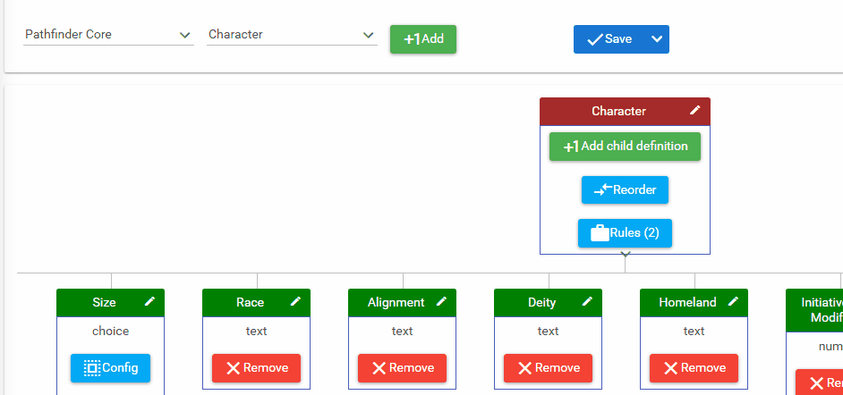
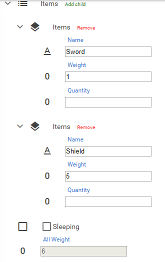
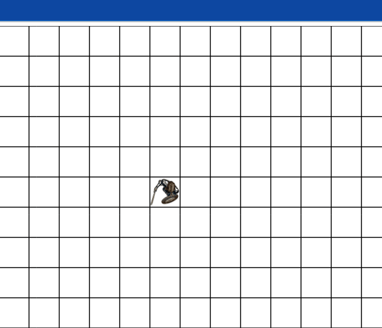
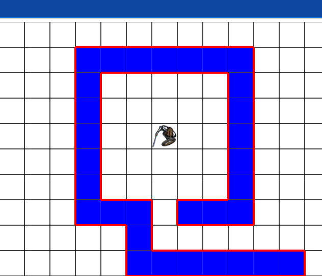
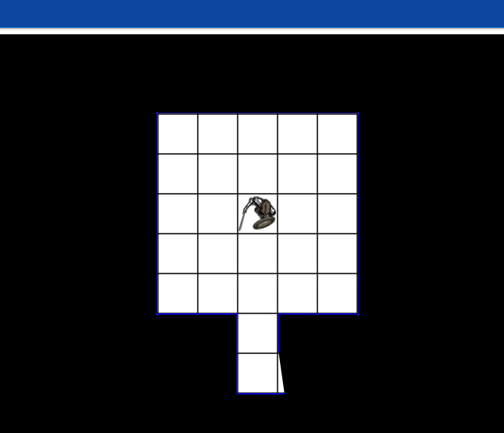

# Untold

This is the front-end of my experimental virtual tabletop application. I started this software years ago to learn Angular. I theorized that forcing myself to solve an actual problem will be more beneficial than creating the (n+1)th hero app. 

I would like to create an application which is very similar to the real life pen and paper RPGs. My problem with the current applications is the fact they are heavily streamline the experience for the sake of accessibility. My dream is to create something that puts the Game Master first who can fully customize how the application works.

In the application the GM creates a Realm which is a shared space where the game takes place. The following parts of the realm are customizable:
* Definitions to describe beings in the realm. For examle: monsters have names, health, etc...
* Entities which are objects created from a definition. For example: a goblin is created from the monster definition.
* Rules which are being executed every time an entity changes. For example: we can create a rule to calculate the total weight of the goblin by the sum of all weight on it.
* Tables which are structured lists. For example: moving speed based on weight. Also rules can look up tables.
* Character sheet which is the way how we display the entities to the user.
* Virtual board where the players can see there characters in the environment and move them just like in a pen and paper RPG.

Please, keep in mind that this application is far from finished. This is the combination of 2 of my favourite hobbies and the scope of the app is a little bit bigger than initially assumed. I continue working on it and I hope I can eventually release it someday.

# The stack

Since I didn't want to reinvent the wheel every single time, I spent a lot of time researching open source libraries which can be utilized to help me achieve my goal. 

[Angular](https://angular.io/): I use it since RC and I believe this is the best available framework.

[PrimeNG](https://www.primefaces.org/primeng): UI library for Angular.

[NGRX Store](https://github.com/ngrx/store): A great way to manage states and share data between components.

[Auth0](https://auth0.com/): The leading authentication library.

[.Net](https://www.microsoft.com/net): I built the Wweb API and the data access layer with this framework.

[SignalR](https://www.asp.net/signalr): This library help us to create real-time web functionality. This feature is a must have if we want players to interact with eachother.

[Azure Storage](https://azure.microsoft.com/en-us/services/storage/): In a multiplayer game we don't want the clients to call the server for every single resource. With the azure table and blob storage I was able to "outsorce" the text and file resources which reduced the load on the server.

[LZ String](http://pieroxy.net/blog/pages/lz-string/index.html): I used it to compress the strings before sending them to the store.

[CreateJS](https://createjs.com/): This very powerful Javascript canvas library helped me creating the virtual board.

[Papa Parse](https://www.papaparse.com/): An in-browser csv parser.

[JSEP](http://jsep.from.so/): This expression parser helped me to build binary trees from expressions provided by the user.

# Walkthrough

In this section I would like to demonstrate the current state of the application.

## Starting a realm 

When the players open the application they have to select the realm they want to use. All players in the realm will be notified.

## Tables

Tables are being used to structure data. The modifiers by weight, the shopkeepers inventory. All of these can be stored in a table.

Tables can be created manually where you add all the columns then create a row for every single item in the list.

Or you can use the import wizard to process csv files from your computer.

## Definitions

A definition is very similar to what we call a class in object oriented programming. A simple example would be an item carried by our characters.

As you can see an item has a name, a weight and a quantity.

A more complex definition is the character which stores all properties of a character. A definition can contain: text, yes/no, number fields, also other definitions and lookup values from tables.

This definition has a rule which populates the All weight based on the sum of the individual items.

# Entities

Unfortunately, the current solution to create character sheets is a dead end. I'm currently working on a method to create a drag and drop sheet builder. In the moment, only a basic treeview display available for the entities which is not very usable for a game but it's enough for testing.

As you can see the entity calculated the read-only All weight property based on the items.

# Board

The board is the most important element of the game. It has 4 layers.

The foreground and background layers are there to display images. A player can see the background images but not able to interact with them. For example floor textures.

The grid is for the GM only who can easily create walls.

 

The wall layer displays all the walls created by the grid system and also let's the GM to add more walls to increase the experience.

Finally, the player can start his/her journey on the foreground layer.

